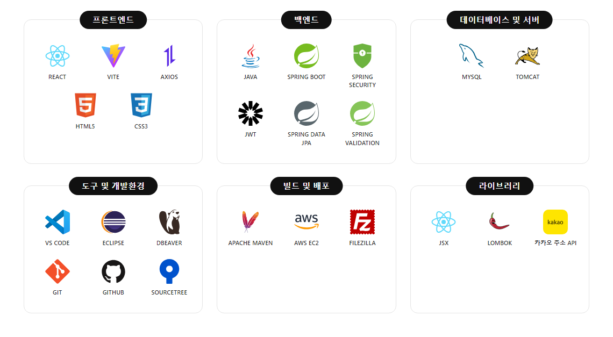
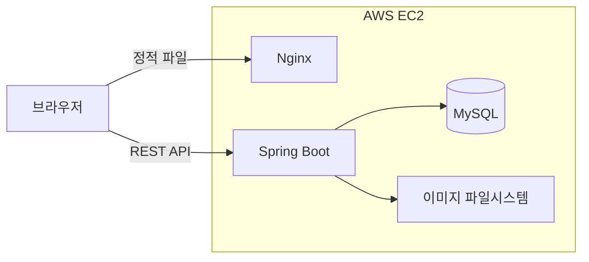
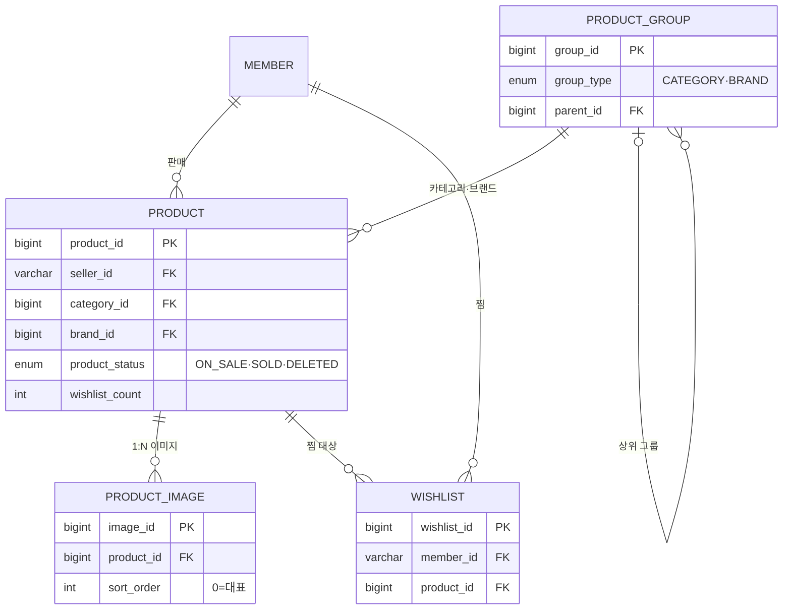
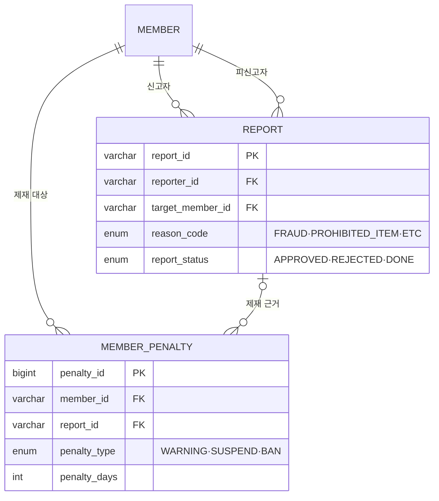

## 프로젝트 소개
<table>
<tr><td style="border: 3px solid #b0b0b0; padding: 16px;">

어디서도 팔지 않는 단종 상품, 다시 발매되지 않는 한정판. 세상에는 중고 시장에서만 구할 수 있는 물건들이 있습니다. 여기에 같은 물건을 더 합리적인 가격에 구할 수 있다는 장점까지 더해지며, 중고거래는 이제 누구나 이용하는 일상적인 소비 방식이 되었습니다.

하지만 거래가 늘어난 만큼 **사기 피해**도 함께 늘었습니다. 중고 직거래 사기는 2025년 약 12만 건으로 5년 내 최고치를 기록했고, 누적 피해액은 1조 7천억 원을 넘어섰습니다. **원하는 물건을 찾기도 어렵고, 찾은 뒤에도 상대를 신뢰하기 어렵다**는 문제는 여전히 남아 있습니다.

**Nailed**는 이 문제점을 해결하기 위해 설계된 중고거래 플랫폼입니다. 원하는 조건의 상품을 정확하게 탐색할 수 있는 검색 환경과, 서로를 알지 못하는 개인 간에도 안심하고 거래할 수 있는 운영 체계를 갖추는 것을 목표로 개발했습니다.

</td></tr>
</table>

## 담당 기능 (Backend)

상품(Product)·찜(Wishlist)·리뷰(Review)·신고(Report) 도메인의 <b>테이블 설계 및 API 개발</b>을 담당

<table>
  <tr>
    <th nowrap>도메인</th>
    <th align="left">담당 기능</th>
  </tr>
  <tr>
    <td nowrap align="center"><b>상품</b></td>
    <td>테이블 설계(상품·카테고리·브랜드·이미지) · 상품 CRUD · 검색/필터(키워드·카테고리·가격·컨디션) · 정렬(최신·가격·인기순) · 상세 조회 · 조회수 집계 · 이미지 업로드 · 홈 화면 조회(신상품·인기·연관 상품) · 관리자 블라인드/복구</td>
  </tr>
  <tr>
    <td nowrap align="center"><b>찜</b></td>
    <td>테이블 설계 · 찜 등록/취소 · 마이페이지 찜 목록 · 상품별 찜 수 집계</td>
  </tr>
  <tr>
    <td nowrap align="center"><b>리뷰</b></td>
    <td>리뷰 작성(구매자) · 판매자 리뷰 목록 조회(평균 별점 포함)</td>
  </tr>
  <tr>
    <td nowrap align="center"><b>신고</b></td>
    <td>신고 접수 · 신고 내역 조회 · 관리자 처리(반려·제재)</td>
  </tr>
</table>

<details>
<summary><h2>주요 API</h2></summary>

| 메서드 | 경로 | 설명 |
|---|---|---|
| GET | /api/products | 상품 목록 (카테고리·가격·사이즈·컨디션 필터, 페이징) |
| GET | /api/products/search | 키워드 검색 |
| GET | /api/products/{id} | 상품 상세 |
| POST | /api/products/image-upload | 이미지 임시 업로드 (다중) |
| POST | /api/products | 상품 등록 |
| PUT | /api/products/{id} | 상품 수정 |
| DELETE | /api/products/{id} | 상품 소프트 삭제 |
| POST | /api/products/{id}/view | 조회수 증가 |
| GET | /api/products/popular | 인기 TOP (가중치 정렬) |
| GET | /api/products/{id}/related | 연관 상품 |
| POST | /api/products/{id}/wishlist | 찜 등록 |
| DELETE | /api/products/{id}/wishlist | 찜 취소 |
| GET | /api/members/mypage/wishlist | 내 찜 목록 |

</details>

## ⌘ 기술 스택

<details>
  <summary><h3>기술 스택 모음</h3></summary>



</details>

### 언어 (Language)
[](https://openjdk.org/)
[](https://developer.mozilla.org/docs/Web/JavaScript)

### 백엔드 (Backend)
[](https://spring.io/projects/spring-data-jpa)
[](https://spring.io/projects/spring-security)
[](https://jwt.io/)
[](https://developer.mozilla.org/docs/Glossary/REST)

### 프론트엔드 (Frontend)
[](https://react.dev/)

### 데이터베이스 (Database)
[](https://www.mysql.com/)
[](https://dbeaver.io/)

### 배포 & 인프라 (Infra & Deploy)
[](https://aws.amazon.com/)
[](https://nginx.org/)
[](https://www.docker.com/)
[](https://filezilla-project.org/)

### 형상관리 & 협업 (Collaboration)
[](https://git-scm.com/)
[](https://github.com/)
[](https://www.sourcetreeapp.com/)

<br/>

## ⌬ 시스템 구성



한 대의 EC2 안에서 Nginx가 React 빌드 결과물을 정적 파일로 내려주고, API 요청은 Spring Boot로 넘깁니다. 상품 이미지는 별도 스토리지 없이 서버 파일시스템에 저장하고 `/images/products/**` 경로로 서빙하는 구조로 두었습니다.

<br/>

## ⌬ 프로젝트 구조

<details>
  <summary><h3>프로젝트 구조 보기</h3></summary>

```
backend/src/main/java/com/nailed/
├── 📁web/
│   ├── 📁product/       # 상품 도메인 - CRUD, 검색·정렬, 이미지 (담당)
│   ├── 📁wishlist/      # 찜 도메인 - 등록/취소, 찜 수 동기화 (담당)
│   ├── 📁admin/         # 관리자 - 상품 블라인드, 신고 처리 (담당 영역 포함)
│   ├── 📁report/        # 신고 도메인 (담당)
│   ├── 📁member/        # 회원 (팀)
│   ├── 📁order/         # 주문 (팀)
└── 📁common/            # 응답 포맷, 예외 처리 등 공통 규격
```

</details>

<br/>

## 담당 도메인 ERD



신고·제재 도메인 (관리자)


<details>
<summary><h3>⊞ 주요 테이블 구조 보기</h3></summary>

### `products` — 상품

| 컬럼 | 타입 / 제약 | 설명 |
|------|-------------|------|
| `product_id` | BIGINT, PK, AUTO | 상품 식별자 |
| `seller_id` | BIGINT, FK→members, NOT NULL | 판매자 |
| `category_id` | BIGINT, FK→product_groups, NOT NULL | 카테고리(필수) |
| `brand_id` | BIGINT, FK→product_groups | 브랜드(선택) |
| `title` | VARCHAR(100), NOT NULL | 상품명 |
| `price` | INT, NOT NULL | 가격 |
| `shipping_fee` | INT, NOT NULL | 배송비 |
| `description` | TEXT, NOT NULL | 상세 설명 |
| `condition_code` | ENUM(S/A/B/C/D), NOT NULL | 상품 상태 등급 |
| `shipping_method` | VARCHAR(20), NOT NULL | 배송 방법(기본 `DELIVERY`) |
| `size` | VARCHAR(30) | 사이즈 |
| `product_status` | ENUM(ON_SALE/SOLD/DELETED), NOT NULL | 판매 상태 |
| `hashtags` | VARCHAR(500) | 해시태그(쉼표 구분) |
| `view_count` | INT, NOT NULL | 조회수 |
| `wishlist_count` | INT, NOT NULL | 찜수 |
| `deleted_reason` | VARCHAR(500) | 삭제 사유 |
| `created_at / updated_at / deleted_at` | DATETIME | 소프트 삭제(자동 관리) |

### `product_groups` — 카테고리 / 브랜드 

| 컬럼 | 타입 / 제약 | 설명 |
|------|-------------|------|
| `group_id` | BIGINT, PK, AUTO | 그룹 식별자 |
| `group_type` | ENUM(CATEGORY/BRAND), NOT NULL | 카테고리/브랜드 구분 |
| `parent_id` | BIGINT, FK→product_groups(자기참조) | 상위 그룹(최상위·브랜드는 null) |
| `code` | VARCHAR(50), NOT NULL, UNIQUE | 식별 코드(예: `CLOTHES_TOP`, `NIKE`) |
| `name` | VARCHAR(100), NOT NULL | 화면 표시명 |
| `sort_order` | INT | 정렬 순서 |
| `size_type` | VARCHAR(20) | 사이즈 유형 |

### `product_images` — 상품 이미지

| 컬럼 | 타입 / 제약 | 설명 |
|------|-------------|------|
| `image_id` | BIGINT, PK, AUTO | 이미지 식별자 |
| `product_id` | BIGINT, FK→products, NOT NULL | 소속 상품(`cascade delete` + `orphan removal`) |
| `image_url` | VARCHAR(500), NOT NULL | 이미지 경로 |
| `sort_order` | INT, NOT NULL | 표시 순서(`0` = 대표) |
| `created_at` | DATETIME | 생성 시각 |

### `wishlists` — 찜

| 컬럼 | 타입 / 제약 | 설명 |
|------|-------------|------|
| `wishlist_id` | BIGINT, PK, AUTO | 찜 식별자 |
| `member_id` | BIGINT, FK→members, NOT NULL | 찜한 회원 |
| `product_id` | BIGINT, FK→products, NOT NULL | 찜한 상품 |
| — | UNIQUE(`member_id`, `product_id`) | 중복 찜 방지 |

### `reports` — 신고

| 컬럼 | 타입 / 제약 | 설명 |
|------|-------------|------|
| `report_id` | VARCHAR(20), PK | 애플리케이션 생성(예: `RPT_001`) |
| `reporter_id` | BIGINT, FK→members, NOT NULL | 신고자 |
| `reason_code` | ENUM(FRAUD/MISLEADING_INFO/PROHIBITED_ITEM/ETC), NOT NULL | 신고 사유 |
| `detail` | VARCHAR(500) | 상세 내용(선택) |
| `target_member_id` | BIGINT, FK→members, NOT NULL | 피신고 회원 |
| `report_status` | ENUM(APPROVED/REJECTED/DONE), NOT NULL | 처리 상태 |
| `processed_reason` | VARCHAR(500) | 관리자 처리 사유 |
| `processed_at` | DATETIME | 처리 일시 |
| `created_at` | DATETIME | 접수 시각 |

### `member_penalties` — 회원 제재

| 컬럼 | 타입 / 제약 | 설명 |
|------|-------------|------|
| `penalty_id` | BIGINT, PK, AUTO | 제재 식별자 |
| `member_id` | BIGINT, FK→members, NOT NULL | 제재 대상 회원 |
| `penalty_type` | ENUM(WARNING/SUSPEND/BAN), NOT NULL | 제재 유형 |
| `penalty_days` | INT | 제재 일수(3/7/30) |
| `reason` | VARCHAR(500), NOT NULL | 제재 사유 |
| `report_id` | VARCHAR(20), FK→reports | 연관 신고 |
| `starts_at` | DATETIME | 제재 시작 |
| `ends_at` | DATETIME | 제재 종료 |
| `created_at` | DATETIME | 생성 시각 |

</details>

## ✦ 주요 기능

### `01` 회원
- **회원가입 / 로그인** — 회원가입, 로그인 유지, 비밀번호 재설정
- **마이페이지** — 프로필 관리, 판매 상품 · 구매 내역 확인

### `02` 상품 판매
- **상품 등록** — 사진 여러 장과 카테고리 · 브랜드 · 사이즈 · 상태 · 가격 입력
- **상품 수정 / 삭제** — 판매 중 상품 정보 변경, 판매 완료 처리

### `03` 상품 탐색
- **검색 · 상세 필터** — 키워드에 카테고리 · 가격대 · 사이즈 · 상품 상태 조건을 조합
- **정렬** — 최신순 / 인기순 
- **홈 화면** — 신상품, 인기 TOP, 랜덤 추천, 연관 상품 노출

### `04` 찜
- **찜 추가 / 해제** — 마음에 드는 상품을 원클릭으로 저장
- **찜 목록** — 마이페이지에서 찜한 상품 모아보기

### `05` 주문
- **상품 구매** — 판매 중인 상품 주문, 주문 상태 확인
- **주문 취소** — 구매자 취소 요청 → 판매자 승인으로 확정

### `06` 신뢰 · 안전
- **리뷰** — 거래 완료 후 판매자 리뷰 작성, 판매자 평점 확인
- **신고** — 부적절한 상품 · 비매너 이용자 신고
- **1:1 문의** — 궁금한 점 문의하고 답변 확인

### `07` 관리자
- **상품 블라인드** — 부적절한 상품 숨김 처리, 문제 해결 시 복구
- **신고 처리** — 접수된 신고를 반려하거나 제재로 확정
- **회원 제재** — 악성 이용자 경고 · 이용 정지

## ⌬ 기능별로 신경 쓴 점

**검색 조건의 확장을 전제로 설계했습니다.**
초기에는 키워드만 받았으나 카테고리·가격대·사이즈·컨디션·판매완료 제외까지 조건이 추가됐습니다. 메서드 파라미터를 개별로 늘리는 대신 `ProductSearchCondition` 객체로 묶어 전달하도록 했고, 조건이 추가돼도 컨트롤러·서비스·리포지토리의 시그니처가 바뀌지 않습니다.

**인기순 정렬에 찜 수를 가중 반영했습니다.**
단순 조회보다 찜이 더 강한 관심 지표라고 판단해 `view_count + wishlist_count * 3` 점수로 정렬합니다. 가중치 3배는 데이터로 검증한 값이 아니라 임의로 설정한 값이며, 이 부분은 아래 트러블슈팅에 남겨 뒀습니다.

**이미지 업로드 시점에는 파일명에 쓸 상품 번호가 없습니다.**
이미지는 상품이 저장되기 전에 업로드되므로 상품 PK를 파일명에 쓸 수 없습니다. 업로드 단계에서는 UUID 임시 파일명으로 저장하고, 상품 등록이 확정되는 시점에 별도 시퀀스 테이블(`ProductPrdSequence`)에서 번호를 발급받아 `PRD_{시퀀스}_{순번}` 형태로 리네이밍하는 2단계 방식으로 처리했습니다. 상품과 이미지는 1:N 관계로 두고 `cascade`·`orphanRemoval`을 적용해, 상품 수정 시 이미지 교체·삭제가 함께 반영됩니다.

**삭제는 소프트 삭제로 처리했습니다.**
상품은 주문·신고 등 다른 데이터와 참조 관계가 있어 물리 삭제가 위험합니다. 상태를 `DELETED`로 변경하고 삭제 사유와 시각을 기록하며, 이 설계 덕분에 관리자가 블라인드한 상품을 복구할 수 있습니다.

**신고는 상태 전이를 제한했습니다.**
접수(APPROVED)에서 반려(REJECTED) 또는 제재완료(DONE)로만 전이되며, 제재 시 대상 회원에게 경고/정지/영구정지 penalty를 함께 생성합니다. 접수 상태가 아닌 신고는 처리되지 않도록 방어 로직을 두어 중복 제재를 차단했습니다.

공통 규격(응답 포맷, 전역 예외 처리, 공통 엔티티)은 팀에서 정한 규약을 따랐습니다.

<br/>

## ⚡트러블 슈팅

### 상품 상세에서 쿼리가 너무 많이 나가던 문제

<details>
<summary>1. 문제점 (Problem)</summary>

<br>

상품 상세를 열면 판매자·카테고리·브랜드가 모두 지연 로딩이라, 각 정보를 참조할 때마다 SELECT가 별도로 나갔습니다. 카테고리는 `맨즈웨어 > 상의 > 티셔츠`처럼 상위 카테고리를 자기참조로 타고 올라가는 계층 구조여서, 전체 경로를 만드는 동안 깊이만큼 쿼리가 더 붙었습니다.

</details>

<details>
<summary>2. 원인 (Cause)</summary>

<br>

지연 로딩과 자기참조 계층이 겹쳐 생긴 N+1이었습니다. 지연 로딩이라 연관 값을 실제로 꺼내 쓰는 순간에야 쿼리가 나가고, 카테고리는 상위로 올라갈 때마다 SELECT가 한 번씩 더 붙습니다. `show-sql`을 켜고 상세를 열 때 쿼리가 몇 번 나가는지 직접 세어 보며 원인을 좁혔습니다.

</details>

<details>
<summary>3. 해결 과정 (Solution)</summary>

<br>

상세 조회 전용으로 `findByIdWithFetch`를 만들어 필요한 연관 엔티티를 `JOIN FETCH`로 한 번에 가져오게 했습니다. 브랜드는 없을 수 있는 값이라 `LEFT JOIN FETCH`로 두어, 브랜드 없는 상품이 결과에서 빠지지 않게 했습니다.

```sql
SELECT p FROM Product p
  JOIN FETCH p.seller
  JOIN FETCH p.category c
  LEFT JOIN FETCH c.parent          -- 상위 카테고리
  LEFT JOIN FETCH c.parent.parent   -- 상위의 상위 (brand 는 null 허용 → LEFT)
  LEFT JOIN FETCH p.brand
 WHERE p.productId = :id AND p.productStatus <> :deleted
```

이미지 목록·리뷰 통계·찜 여부는 이 쿼리에 합치지 않고 따로 뒀습니다. 이미지는 1:N이라 같이 조인하면 상품 행이 이미지 수만큼 늘어나고, 나머지는 성격이 다른 집계라 한 쿼리에 묶는 게 오히려 손해라고 봤습니다.

</details>

<details>
<summary>4. 결과 및 배운 점 (Result & Learnings)</summary>

<br>

연관 엔티티를 가져오는 쿼리가 한 번으로 줄었습니다. 페치 조인이 항상 답은 아니어서, 컬렉션이나 집계는 오히려 분리하는 편이 낫다는 기준을 얻었습니다.

</details>

<br/>

### 조회수·찜 수가 동시 요청에서 어긋날 수 있던 문제

<details>
<summary>1. 문제점 (Problem)</summary>

<br>

초기 구현은 엔티티를 조회해 값을 +1 한 뒤 다시 저장하는 방식이었습니다. 두 요청이 거의 동시에 들어오면 둘 다 같은 값을 읽고 각자 +1 해서 저장하기 때문에, 한 번의 증가가 사라지고 카운트가 실제보다 작게 남을 수 있었습니다.

</details>

<details>
<summary>2. 원인 (Cause)</summary>

<br>

`조회 → 계산 → 저장`이 한 덩어리로 처리되지 않아서 생기는 Lost Update(갱신 유실)입니다. 두 요청이 같은 값을 읽는 순간, 나중에 저장한 쪽이 먼저 저장한 쪽의 증가분을 덮어씁니다. 값을 코드에서 읽어 더하는 방식인 한 이 틈은 없어지지 않습니다.

</details>

<details>
<summary>3. 해결 과정 (Solution)</summary>

<br>

값을 읽어 더하는 대신 `@Modifying` 벌크 UPDATE로 증감을 DB에서 바로 계산하게 바꿨습니다. 더하는 일을 DB가 한 번에 처리하니, 동시 요청이 겹쳐도 값이 유실되지 않습니다.

```sql
UPDATE Product p SET p.wishlistCount = p.wishlistCount - 1
 WHERE p.productId = :productId AND p.wishlistCount > 0   -- 0 미만 방지
```

벌크 UPDATE는 영속성 컨텍스트를 거치지 않아, 실행 뒤 `clearAutomatically`로 컨텍스트를 비워 캐시와 DB 값을 맞췄습니다. 다만 찜 취소는 `찜 DELETE → 카운트 -1` 순인데 DELETE가 flush되기 전에 컨텍스트를 비우면 DELETE가 사라지므로, `flushAutomatically`로 비우기 전에 먼저 반영하게 했습니다.

</details>

<details>
<summary>4. 결과 및 배운 점 (Result & Learnings)</summary>

<br>

읽기·수정·저장 세 단계가 UPDATE 한 문장으로 줄어, 요청이 동시에 들어와도 카운트가 유실되지 않습니다. 동시성 문제는 정상 시나리오만 봐서는 드러나지 않고, 두 요청이 겹치는 순간을 가정해야 보인다는 걸 배웠습니다.

</details>
