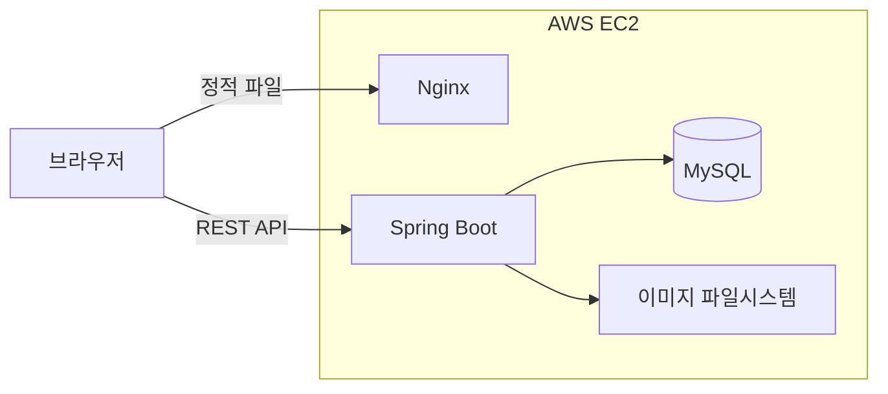
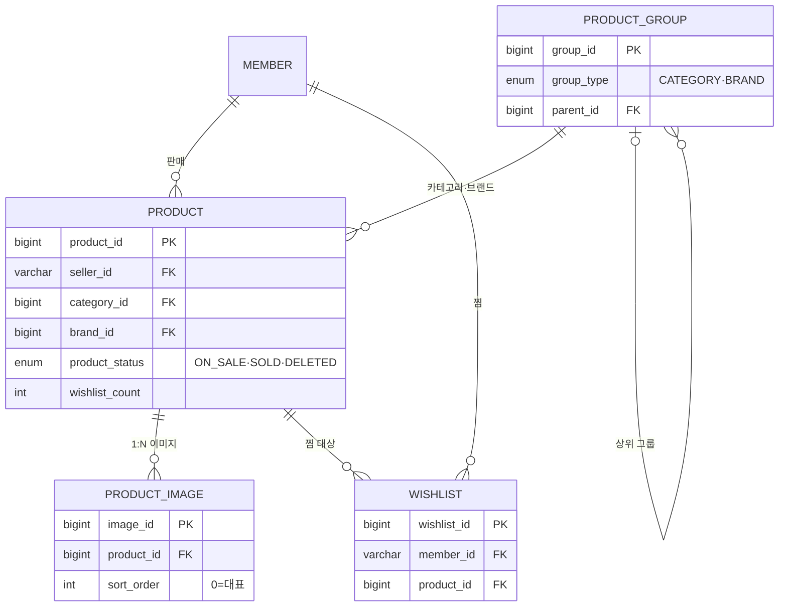
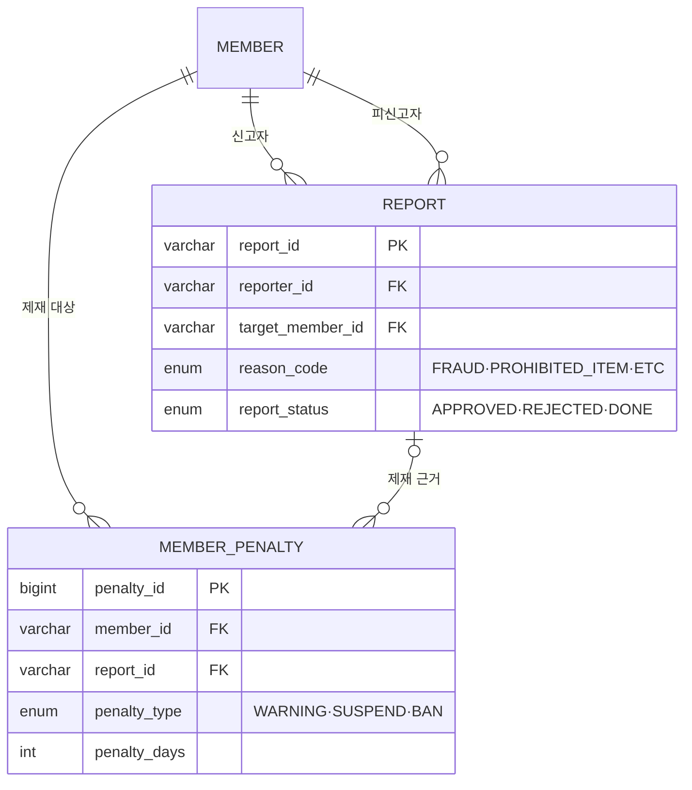

# 중고거래 플랫폼 Nailed

의류·잡화 중심의 개인 간(C2C) 중고거래 플랫폼입니다. 

- 배포 주소: http://13.125.205.120/
- 개발 기간: 2026.04 ~ 2026.06
- 팀 구성: 3인 (도메인별 분담)
- 사용 기술: Java 21, Spring Boot 3.5, Spring Data JPA, Spring Security + JWT, MySQL, AWS EC2, Nginx

> 이 저장소는 팀 프로젝트의 백엔드·프론트 소스를 포트폴리오용으로 한곳에 모아 재구성 했습니다. 실제 개발 커밋 히스토리는 팀 원본 백엔드 저장소에서 확인할 수 있습니다 → [byeongminjeong49-ui/nailed_BE](https://github.com/byeongminjeong49-ui/nailed_BE)

## 담당 역

상품·찜 도메인은 테이블 설계와 API를 제작했고, 관리자 기능 중 상품 관리와 신고 처리를 담당했습니다.

| 도메인 | 한 일 | 특히 고민한 것 |
|---|---|---|
| 상품 | CRUD, 복합 조건 검색·정렬, 이미지 1:N 관리, 홈 상품 조회 | 늘어나는 검색 조건, [상세 조회 N+1](#상품-상세에서-쿼리가-너무-많이-나가던-문제) |
| 찜 | 찜 등록·취소, 마이페이지 찜 목록, 상품 찜 수 동기화 | [동시 요청에서 카운트 유실](#조회수찜-수가-동시-요청에서-어긋날-수-있던-문제) |
| 관리자 | 상품 블라인드·복구, 신고 반려·제재 처리 | 소프트 삭제, 신고 상태 전이 방어 |

---

## 기술 스택

[담당 영역 백엔드]

| 구분 | 기술 |
|---|---|
| Backend | Java 21, Spring Boot 3.5, Spring Data JPA (Hibernate), Spring Security + JWT, MySQL |
| Frontend | React 19, Vite |
| Infra | AWS EC2, Nginx |

---

## 시스템 구성



한 대의 EC2 안에서 Nginx가 React 빌드 결과물을 정적 파일로 내려주고, API 요청은 Spring Boot로 넘깁니다. 상품 이미지는 별도 스토리지 없이 서버 파일시스템에 저장하고 `/images/products/**` 경로로 서빙하는 구조로 두었습니다.

---

## 담당 도메인 ERD

제가 맡은 테이블을 한눈에 보기 쉽게 **상품·찜**과 **신고·제재** 두 묶음으로 나눴습니다. 여기엔 핵심 컬럼만 넣었고, 전체 컬럼은 맨 아래 접이식으로 정리해 뒀습니다.

상품·찜 도메인



신고·제재 도메인 (관리자)



<details>
<summary>전체 컬럼 상세 스키마 (펼치기)</summary>

| 테이블 | 주요 컬럼 |
|---|---|
| products | product_id(PK), seller_id·category_id·brand_id(FK), title, price, shipping_fee, condition_code(S~D), product_status(ON_SALE/SOLD/DELETED), view_count, wishlist_count, deleted_reason, deleted_at |
| product_groups | group_id(PK), group_type(CATEGORY/BRAND), parent_id(FK, 자기참조), code(UK), name, size_type |
| product_images | image_id(PK), product_id(FK), image_url, sort_order(0=대표) |
| wishlists | wishlist_id(PK), member_id·product_id(FK), UNIQUE(member_id, product_id) |
| reports | report_id(PK, RPT_001), reporter_id·target_member_id(FK), reason_code(FRAUD/MISLEADING_INFO/PROHIBITED_ITEM/ETC), detail, report_status(APPROVED/REJECTED/DONE), processed_reason, processed_at |
| member_penalties | penalty_id(PK), member_id·report_id(FK), penalty_type(WARNING/SUSPEND/BAN), penalty_days(3/7/30), reason, starts_at, ends_at |

</details>

---

## 담당 역할

| 영역 | 구현 내용 |
|---|---|
| 상품 CRUD | 상품 등록·상세·수정·삭제 (`product` 패키지 전체) |
| 상품 검색·정렬 | 키워드·카테고리·가격대·사이즈·컨디션 복합 조건 검색, 최신순·인기순 정렬 |
| 상품 이미지 | 상품 1건에 여러 이미지(`ProductImage` 1:N), 업로드·교체·삭제 |
| 홈 상품 조회 | 신상품·인기 TOP·랜덤·연관상품 |
| 찜 | 찜 등록·취소, 마이페이지 찜 목록, 상품 찜 수 동기화 (`wishlist` 패키지) |
| 관리자 상품 | 상태별 목록 조회, 부적절 상품 블라인드·복구 |
| 관리자 신고 | 신고 반려·제재 처리, 제재(penalty) 연동 생성 |

### 주요 API

| 메서드 | 경로 | 설명 |
|---|---|---|
| GET | `/api/products` | 상품 목록 (카테고리·가격·사이즈·컨디션 필터, 페이징) |
| GET | `/api/products/search` | 키워드 검색 |
| GET | `/api/products/{id}` | 상품 상세 |
| POST | `/api/products/image-upload` | 이미지 임시 업로드 (다중) |
| POST | `/api/products` | 상품 등록 |
| PUT | `/api/products/{id}` | 상품 수정 |
| DELETE | `/api/products/{id}` | 상품 소프트 삭제 |
| POST | `/api/products/{id}/view` | 조회수 증가 |
| GET | `/api/products/popular` | 인기 TOP (가중치 정렬) |
| GET | `/api/products/{id}/related` | 연관 상품 |
| POST | `/api/products/{id}/wishlist` | 찜 등록 |
| DELETE | `/api/products/{id}/wishlist` | 찜 취소 |
| GET | `/api/members/mypage/wishlist` | 내 찜 목록 |

### 기능별로 신경 쓴 점

**검색 조건의 확장을 전제로 설계했습니다.** 초기에는 키워드만 받았으나 카테고리·가격대·사이즈·컨디션·판매완료 제외까지 조건이 추가됐습니다. 메서드 파라미터를 개별로 늘리는 대신 `ProductSearchCondition` 객체로 묶어 전달하도록 했고, 조건이 추가돼도 컨트롤러·서비스·리포지토리의 시그니처가 바뀌지 않습니다.

**인기순 정렬에 찜 수를 가중 반영했습니다.** 단순 조회보다 찜이 더 강한 관심 지표라고 판단해 `view_count + wishlist_count * 3` 점수로 정렬합니다. 가중치 3배는 데이터로 검증한 값이 아니라 임의로 설정한 값이며, 이 부분은 아래 회고에 남겨 뒀습니다.

**이미지 업로드 시점에는 파일명에 쓸 상품 번호가 없습니다.** 이미지는 상품이 저장되기 전에 업로드되므로 상품 PK를 파일명에 쓸 수 없습니다. 업로드 단계에서는 UUID 임시 파일명으로 저장하고, 상품 등록이 확정되는 시점에 별도 시퀀스 테이블(`ProductPrdSequence`)에서 번호를 발급받아 `PRD_{시퀀스}_{순번}` 형태로 리네이밍하는 2단계 방식으로 처리했습니다. 상품과 이미지는 1:N 관계로 두고 `cascade`·`orphanRemoval`을 적용해, 상품 수정 시 이미지 교체·삭제가 함께 반영됩니다.

**삭제는 소프트 삭제로 처리했습니다.** 상품은 주문·신고 등 다른 데이터와 참조 관계가 있어 물리 삭제가 위험합니다. 상태를 `DELETED`로 변경하고 삭제 사유와 시각을 기록하며, 이 설계 덕분에 관리자가 블라인드한 상품을 복구할 수 있습니다.

**신고는 상태 전이를 제한했습니다.** 접수(APPROVED)에서 반려(REJECTED) 또는 제재완료(DONE)로만 전이되며, 제재 시 대상 회원에게 경고/정지/영구정지 penalty를 함께 생성합니다. 접수 상태가 아닌 신고는 처리되지 않도록 방어 로직을 두어 중복 제재를 차단했습니다.

공통 규격(응답 포맷, 전역 예외 처리, 공통 엔티티)은 팀에서 정한 규약을 따랐습니다.

---

## 트러블슈팅

### 상품 상세에서 쿼리가 너무 많이 나가던 문제

상품 상세를 열면 판매자·카테고리·브랜드가 모두 지연 로딩이라, 각 정보를 참조할 때마다 SELECT가 별도로 실행됐습니다. 특히 카테고리는 상위 카테고리를 다시 참조하는 계층 구조여서, 전체 경로(`맨즈웨어 > 상의 > 티셔츠`)를 만드는 동안 깊이만큼 쿼리가 추가로 발생했습니다. 전형적인 N+1 문제입니다.

`show-sql` 로그로 쿼리 발생 횟수를 확인한 뒤, 상세 조회 전용으로 `findByIdWithFetch`를 정의해 필요한 연관 엔티티를 `JOIN FETCH`로 한 번에 조회하도록 변경했습니다. 브랜드는 null이 허용되는 값이므로 `LEFT JOIN FETCH`를 적용해, 브랜드가 없는 상품이 결과에서 누락되지 않게 했습니다.

```java
// 상세 페이지 전용 - seller/category 계층/brand 한 번에 fetch
@Query("SELECT p FROM Product p " +
       "JOIN FETCH p.seller " +
       "JOIN FETCH p.category c " +
       "LEFT JOIN FETCH c.parent cp " +
       "LEFT JOIN FETCH cp.parent " +
       "LEFT JOIN FETCH p.brand " +
       "WHERE p.productId = :id AND p.productStatus != :deleted")
Optional<Product> findByIdWithFetch(@Param("id") Long id, @Param("deleted") ProductStatus deleted);
```

적용 후 상품과 연관 엔티티(판매자·카테고리 계층·브랜드)를 가져오는 쿼리가 한 번으로 줄었습니다. 상세 응답에 함께 필요한 이미지 목록·판매자 리뷰 통계·찜 여부는 성격이 다른 조회라 별도 쿼리로 유지했습니다.

### 조회수·찜 수가 동시 요청에서 어긋날 수 있던 문제

초기에는 엔티티를 조회해 값을 +1 한 뒤 다시 저장하는 방식이었습니다. 이 경우 두 요청이 같은 값을 읽으면 나중 저장이 앞의 증가를 덮어써, 카운트가 유실될 수 있습니다(lost update).

조회와 저장을 분리하지 않고 `@Modifying`으로 `UPDATE ... SET view_count = view_count + 1`을 직접 실행해, 증감을 DB에서 원자적으로 처리하도록 변경했습니다. 감소 연산에는 `wishlist_count > 0` 조건을 걸어 음수를 방지했고, 벌크 연산 이후 영속성 컨텍스트가 DB 상태와 어긋나지 않도록 `clearAutomatically`를 적용했습니다. 찜 취소의 경우 아직 flush되지 않은 찜 DELETE가 컨텍스트 초기화로 유실될 수 있어 `flushAutomatically`를 함께 지정했습니다.

```java
// 찜수 -1 (0 미만 방지 가드 유지, 동시 찜취소 Lost Update 방지)
// flushAutomatically: clear 전에 pending 찜 DELETE를 먼저 DB 반영 (DELETE 유실 방지)
@Modifying(flushAutomatically = true, clearAutomatically = true)
@Transactional
@Query("UPDATE Product p SET p.wishlistCount = p.wishlistCount - 1 " +
       "WHERE p.productId = :productId AND p.wishlistCount > 0")
int decrementWishlistCount(@Param("productId") Long productId);
```

읽기·수정·저장의 세 단계가 UPDATE 한 문장으로 축소됐고, 요청이 동시에 들어와도 DB가 증감을 처리하므로 카운트가 유실되지 않습니다.

---

## 배운 점

- JPA 연관관계에서 쿼리가 언제 몇 번 발생하는지, 페치 조인으로 이를 어떻게 줄이는지 직접 확인하며 이해했습니다.
- 동시성 문제는 코드만 봐서는 드러나지 않고, 두 요청이 겹치는 상황을 가정해야 보인다는 것을 배웠습니다.
- 소프트 삭제로 상태를 관리하면 데이터 추적과 복구가 용이하다는 것을 확인했습니다.
- 인기순 가중치처럼 임의로 정한 값은, 다음에는 실제 조회·찜 데이터를 근거로 결정하려 합니다.

---

## 프로젝트 구조

담당한 백엔드 패키지 위주로 정리하면 다음과 같습니다. 
```
📁 backend/src/main/java/com/nailed/
├── 📁 web/
│   ├── 📁 product/                     # 상품 도메인 (담당)
│   │   ├── 📁 controller/
│   │   │   └── 📁 ProductController.java
│   │   ├── 📁 service/
│   │   │   └── 📁 ProductService.java
│   │   ├── 📁 entity/
│   │   │   ├── 📁 Product.java
│   │   │   ├── 📁 ProductGroup.java     # 카테고리·브랜드 (자기참조 계층)
│   │   │   ├── 📁 ProductImage.java
│   │   │   └── 📁 ProductPrdSequence.java
│   │   ├── 📁 repository/
│   │   │   ├── 📁 ProductRepository.java        # 검색·페치조인·벌크 UPDATE
│   │   │   ├── 📁 ProductGroupRepository.java
│   │   │   ├── 📁 ProductImageRepository.java
│   │   │   └── 📁 ProductPrnSequenceRepository.java
│   │   └── 📁 dto/
│   │       ├── 📁 ProductRequest.java
│   │       ├── 📁 ProductResponse.java
│   │       └── 📁 ProductSearchCondition.java   # 복합 검색 조건 객체
│   │
│   ├── 📁 wishlist/                    # 찜 도메인 (담당)
│   │   ├── 📁 controller/
│   │   │   └── 📁 WishlistController.java
│   │   ├── 📁 service/
│   │   │   └── 📁 WishlistService.java
│   │   ├── 📁 entity/
│   │   │   └── 📁 Wishlist.java
│   │   └── 📁 repository/
│   │       └── 📁 WishlistRepository.java
│   │
│   ├── 📁 admin/                       # 관리자 (상품·신고 처리 담당)
│   │   ├── 📁 controller/
│   │   │   ├── 📁 AdminProductController.java   # 담당
│   │   │   ├── 📁 AdminReportController.java    # 담당
│   │   │   └── 📁 ...                           # 대시보드·회원·주문·문의 (팀)
│   │   └── 📁 service/
│   │       ├── 📁 AdminProductService.java      # 담당
│   │       ├── 📁 AdminReportService.java       # 담당
│   │       └── 📁 ...
│   │
│   ├── 📁 report/                      # 신고 도메인 (담당)
│   ├── 📁 member/                      # 회원 (팀)
│   ├── 📁 order/                       # 주문 (팀)
│   └── 📁 ...
│
└── 📁 common/                          # 팀 공통 규격
    ├── 📁 entity/
    ├── 📁 enums/
    ├── 📁 exception/
    ├── 📁 response/
    └── 📁 util/
```
