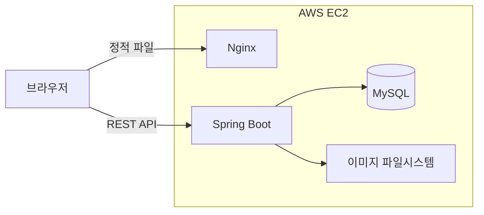
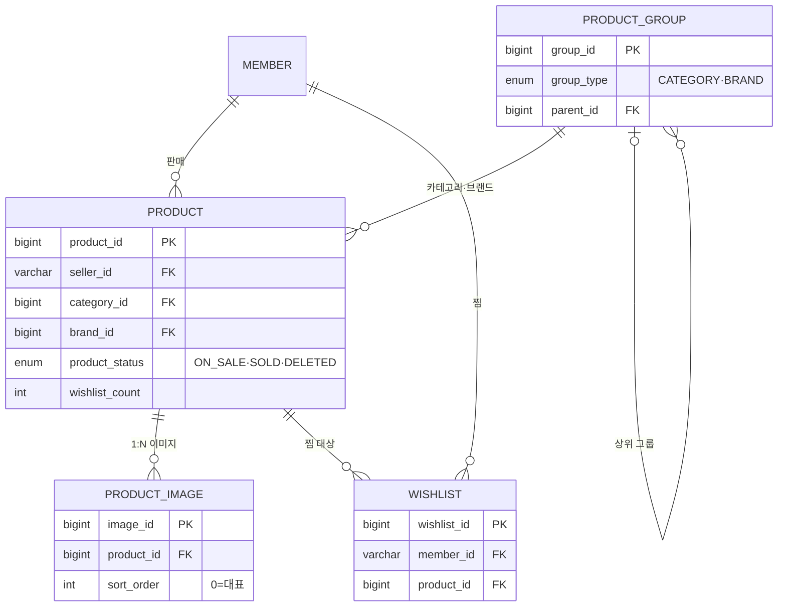
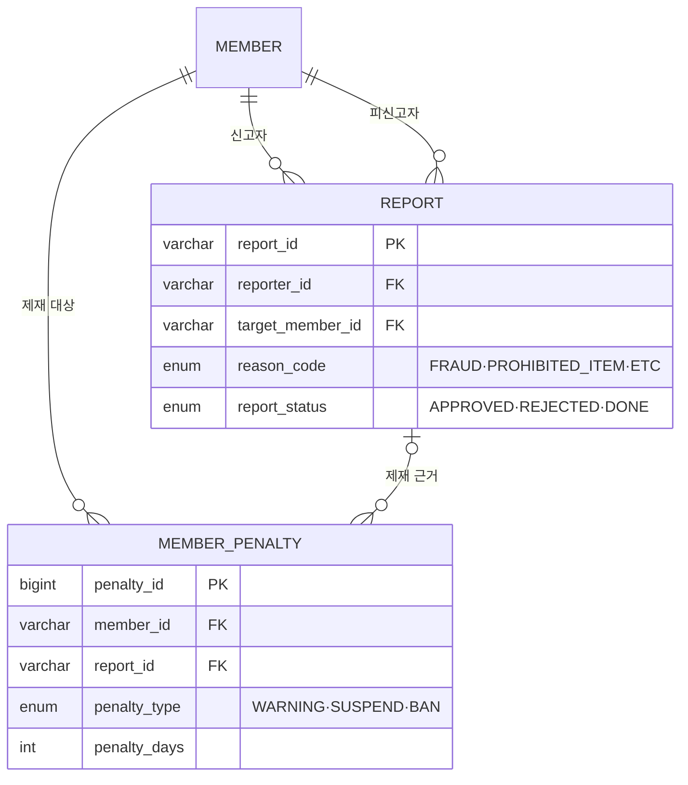

# 중고거래 플랫폼 Nailed

의류·잡화 중심의 개인 간(C2C) 중고거래 플랫폼입니다. 3인 팀 프로젝트로, 상품 등록부터 주문·결제·정산·CS까지 이어지는 흐름을 도메인별로 나눠 만들었습니다. 저는 이 중에서 **상품(Product)과 찜(Wishlist) 도메인 전체, 그리고 관리자 상품·신고 처리의 백엔드**를 맡았습니다.

- 배포 주소: http://13.125.205.120/
- 개발 기간: 2026.04 ~ 2026.06
- 팀 구성: 3인 (도메인별 분담)

> 이 저장소는 팀 프로젝트의 백엔드·프론트 소스를 포트폴리오용으로 한곳에 모아 재구성한 것입니다. 실제 개발 커밋 히스토리(제가 작업한 상품 도메인 커밋 포함)는 팀 원본 백엔드 저장소에서 확인하실 수 있습니다 → [byeongminjeong49-ui/nailed_BE](https://github.com/byeongminjeong49-ui/nailed_BE)

---

## 기술 스택

담당 영역이 백엔드라 아래 표에서 제가 직접 다룬 건 Backend 행입니다. (프론트는 팀에서 함께 작업)

| 구분 | 기술 |
|---|---|
| Backend | Java 21, Spring Boot 3.5, Spring Data JPA (Hibernate), Spring Security + JWT, MySQL |
| Frontend | React 19, Vite |
| Infra | AWS EC2, Nginx |

---

## 시스템 구성



한 대의 EC2 안에서 Nginx가 React 빌드 결과물을 정적 파일로 내려주고, API 요청은 Spring Boot로 넘깁니다. 상품 이미지는 별도 스토리지 없이 서버 파일시스템에 저장하고 `/images/products/**` 경로로 서빙하는 구조로 두었습니다.

---

## 담당 도메인 ERD

제가 맡은 테이블을 한눈에 보기 쉽게 **상품·찜**과 **신고·제재** 두 묶음으로 나눴습니다. 여기엔 핵심 컬럼만 넣었고, 전체 컬럼은 맨 아래 접이식으로 정리해 뒀습니다.

상품·찜 도메인



신고·제재 도메인 (관리자)



<details>
<summary>전체 컬럼 상세 스키마 (펼치기)</summary>

| 테이블 | 주요 컬럼 |
|---|---|
| products | product_id(PK), seller_id·category_id·brand_id(FK), title, price, shipping_fee, condition_code(S~D), product_status(ON_SALE/SOLD/DELETED), view_count, wishlist_count, deleted_reason, deleted_at |
| product_groups | group_id(PK), group_type(CATEGORY/BRAND), parent_id(FK, 자기참조), code(UK), name, size_type |
| product_images | image_id(PK), product_id(FK), image_url, sort_order(0=대표) |
| wishlists | wishlist_id(PK), member_id·product_id(FK), UNIQUE(member_id, product_id) |
| reports | report_id(PK, RPT_001), reporter_id·target_member_id(FK), reason_code(FRAUD/MISLEADING_INFO/PROHIBITED_ITEM/ETC), detail, report_status(APPROVED/REJECTED/DONE), processed_reason, processed_at |
| member_penalties | penalty_id(PK), member_id·report_id(FK), penalty_type(WARNING/SUSPEND/BAN), penalty_days(3/7/30), reason, starts_at, ends_at |

</details>

---

## 담당 역할

상품·찜 도메인은 설계부터 API까지 혼자 맡아서 만들었고, 관리자 기능 중에서는 상품 관리와 신고 처리의 API·비즈니스 로직을 담당했습니다. (관리자 화면 자체는 팀에서 함께 만들었고, 저는 그 화면이 호출하는 서버 쪽을 담당했습니다.)

| 영역 | 구현 내용 |
|---|---|
| 상품 CRUD | 상품 등록·상세·수정·삭제 (`product` 패키지 전체) |
| 상품 검색·정렬 | 키워드·카테고리·가격대·사이즈·컨디션 복합 조건 검색, 최신순·인기순 정렬 |
| 상품 이미지 | 상품 1건에 여러 이미지(`ProductImage` 1:N), 업로드·교체·삭제 |
| 홈 상품 조회 | 신상품·인기 TOP·랜덤·연관상품 |
| 찜 | 찜 등록·취소, 마이페이지 찜 목록, 상품 찜 수 동기화 (`wishlist` 패키지) |
| 관리자 상품 | 상태별 목록 조회, 부적절 상품 블라인드·복구 |
| 관리자 신고 | 신고 반려·제재 처리, 제재(penalty) 연동 생성 |

### 주요 API

| 메서드 | 경로 | 설명 |
|---|---|---|
| GET | `/api/products` | 상품 목록·검색 (키워드·카테고리·가격·사이즈·컨디션, 페이징) |
| GET | `/api/products/{id}` | 상품 상세 |
| POST | `/api/products` | 상품 등록 (이미지 다중 업로드) |
| PUT | `/api/products/{id}` | 상품 수정 |
| DELETE | `/api/products/{id}` | 상품 소프트 삭제 |
| GET | `/api/products/popular` | 인기 TOP (가중치 정렬) |
| POST | `/api/products/{id}/wishlist` | 찜 등록 |
| DELETE | `/api/products/{id}/wishlist` | 찜 취소 |
| GET | `/api/members/mypage/wishlist` | 내 찜 목록 |

### 기능별로 신경 쓴 점

**검색은 조건이 계속 늘어날 걸 감안했습니다.** 처음엔 키워드만 받다가 카테고리·가격대·사이즈·컨디션·판매완료 제외까지 조건이 붙었는데, 파라미터를 하나씩 늘리는 대신 `ProductSearchCondition` 객체로 묶어서 받도록 했습니다. 조건이 추가돼도 시그니처가 안 흔들려서 나중에 편했습니다.

**인기순 정렬은 조회수만으로 하지 않았습니다.** 그냥 보기만 한 상품보다 "찜"까지 누른 상품이 더 인기 있다고 봤고, 그래서 `view_count + wishlist_count * 3`으로 정렬합니다. 다만 가중치 3배는 데이터로 검증한 값이 아니라 제가 감으로 정한 값이라, 이 부분은 아래 회고에도 적어 뒀습니다.

**이미지는 등록 시점에 상품 번호가 없다는 게 문제였습니다.** 상품이 저장돼야 PK가 생기는데 이미지는 그 전에 업로드되니까요. 그래서 업로드 때는 UUID 임시 파일명으로 저장해 두고, 상품 등록이 확정되면 `PRD_{상품번호}_{순번}` 형태로 이름을 바꾸는 2단계 방식으로 풀었습니다. 상품과 이미지는 1:N으로 두고 `cascade`·`orphanRemoval`을 걸어, 상품 수정 시 이미지 교체·삭제가 같이 처리되게 했습니다.

**삭제는 진짜로 지우지 않았습니다.** 주문·신고 등 다른 데이터와 얽혀 있어서, 물리 삭제 대신 상태를 `DELETED`로 바꾸고 삭제 사유와 시각을 남깁니다. 덕분에 관리자가 블라인드한 상품을 다시 복구할 수 있습니다.

**신고 처리는 이미 처리된 걸 또 처리하지 못하게 막았습니다.** 신고는 접수(APPROVED) → 반려(REJECTED) 또는 제재완료(DONE)로만 넘어가고, 제재를 할 때는 대상 회원에게 경고/정지/영구정지 penalty를 함께 만듭니다. 접수 상태가 아닌 신고는 처리 자체가 안 되도록 방어 로직을 넣었습니다.

공통 규격(응답 포맷, 전역 예외 처리, 공통 엔티티)은 팀에서 정한 걸 그대로 따랐습니다.

---

## 트러블슈팅

### 상품 상세에서 쿼리가 너무 많이 나가던 문제

상품 상세를 열면 판매자·카테고리·브랜드가 전부 지연 로딩이라, 화면에서 이 정보들을 하나씩 꺼낼 때마다 SELECT가 따로 나갔습니다. 특히 카테고리는 상위 카테고리를 또 참조하는 계층 구조라 단계가 깊어질수록 쿼리가 더 붙었습니다. 전형적인 N+1이었습니다.

`show-sql` 로그로 쿼리가 여러 번 나가는 걸 보고, 상세 조회 전용으로 `findByIdWithFetch`를 만들어 판매자·카테고리(상위 계층 포함)·브랜드를 `JOIN FETCH`로 한 번에 가져오게 했습니다. 브랜드는 없을 수도 있는 값이라 `LEFT JOIN FETCH`로 처리해서, 브랜드 없는 상품이 결과에서 빠지지 않게 했습니다. 이걸 하면서 페치 조인과 지연 로딩의 차이를 실제로 체감했습니다.

### 조회수·찜 수가 동시 요청에서 어긋날 수 있던 문제

처음엔 엔티티를 조회해서 값을 +1 하고 다시 저장하는 방식으로 짰습니다. 그런데 이렇게 하면 두 요청이 같은 값을 읽어 갈 경우 나중 저장이 앞의 증가를 덮어써서 카운트가 유실될 수 있다는 걸 알게 됐습니다(lost update).

그래서 조회-저장을 나누지 않고 `@Modifying`으로 `UPDATE ... SET view_count = view_count + 1`을 직접 실행해 DB에서 한 번에 증가시키도록 바꿨습니다. 찜 취소처럼 감소하는 경우엔 `wishlist_count > 0` 조건을 걸어 음수로 내려가지 않게 했고, 벌크 연산 뒤 영속성 컨텍스트가 DB와 어긋나지 않도록 `clearAutomatically = true`도 함께 뒀습니다.

---

## 배운 점

**배운 점**
- JPA 연관관계에서 언제 쿼리가 몇 번 나가는지, 페치 조인으로 어떻게 줄이는지 직접 확인하면서 감을 잡았습니다.
- 동시성은 코드만 봐선 안 보이고, "두 요청이 겹치면?"을 그려 봐야 문제가 보인다는 걸 배웠습니다.
- 삭제·상태 관리를 소프트 삭제로 설계하면 데이터 추적과 복구가 훨씬 수월하다는 걸 알게 됐습니다.
---

## 프로젝트 구조

담당한 백엔드 패키지 위주로 정리하면 다음과 같습니다.

```
backend/src/main/java/com/nailed/
├── web/
│   ├── product/     # 상품 도메인 (담당) — controller, service, entity, repository, dto
│   ├── wishlist/    # 찜 도메인 (담당)
│   ├── admin/       # 관리자 — 상품·신고 처리 담당
│   ├── report/      # 신고 엔티티 (담당)
│   ├── member/      # 회원 (팀)
│   ├── order/       # 주문 (팀)
│   └── ...
└── common/          # 공통 — entity, enums, response, exception, util (팀 공통 규격)
```
