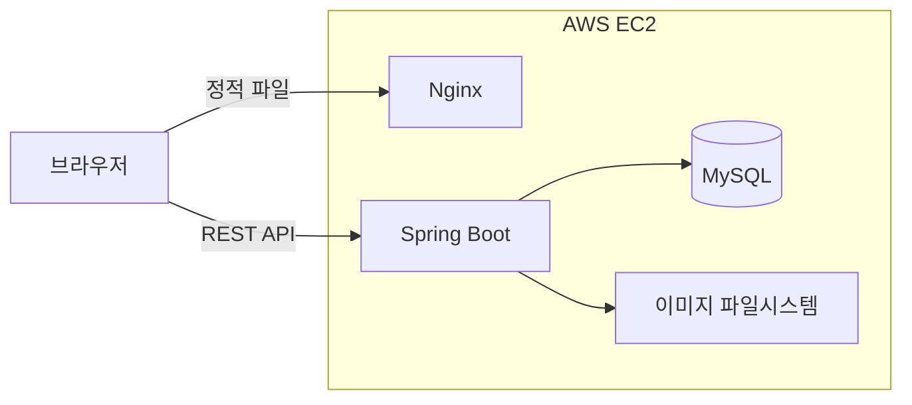
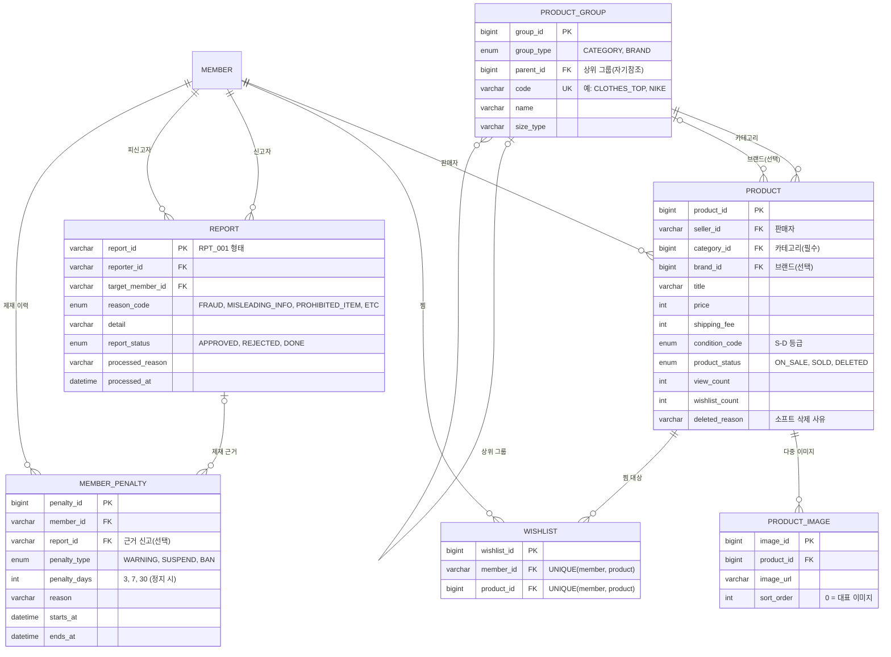

# 중고거래 플랫폼 Nailed

Spring Boot 기반의 중고거래 플랫폼입니다. 상품 등록부터 주문, 결제, 정산, CS까지 이커머스의 전체 트랜잭션 흐름을 3인 팀으로 설계·구현했으며, 저는 **상품(Product)·찜(Wishlist) 도메인과 관리자 상품·신고 처리의 백엔드**를 담당했습니다.

- **배포 주소**: http://13.125.205.120/
- **프로젝트 기간**: 2026.04 ~ 2026.06
- **팀 구성**: 3인 (도메인별 역할 분담)

---

## 🛠 기술 스택

| 구분 | 기술 |
|---|---|
| Backend | Java 21, Spring Boot 3.5, Spring Security (JWT), Spring Data JPA (Hibernate), MySQL |
| Frontend | React 19, Vite |
| Infra / Tools | AWS EC2, Nginx, Git / GitHub |

---

## 🏗 시스템 구성



- Nginx가 React 빌드 산출물을 정적 파일로 서빙하고, Spring Boot가 REST API를 제공합니다.
- 상품 이미지는 서버 파일시스템에 저장하고 정적 리소스 핸들러(`/images/products/**`)로 서빙합니다.

---

## 🗂 담당 도메인 ERD



---

## 👤 담당 역할

**상품(Product)·찜(Wishlist) 도메인의 백엔드**를 단독으로 설계·구현했고, 팀 공용 관리자 기능 중 **상품 관리·신고 처리**의 API와 비즈니스 로직을 담당했습니다.

| 영역 | 구현 내용 |
|---|---|
| 상품 CRUD | 상품 등록·상세·수정·삭제 API (`product` 패키지 Controller/Service/Entity/Repository) |
| 상품 검색·정렬 | 키워드·카테고리·가격대·사이즈·컨디션 복합 조건 검색, 최신순·인기순 정렬 |
| 상품 이미지 | `ProductImage` 1:N 설계, 다중 이미지 업로드·교체·삭제 API |
| 홈 상품 조회 | 신상품·인기 TOP·랜덤·연관상품 조회 API |
| 찜(위시리스트) | 찜 등록·취소, 마이페이지 찜 목록 조회 API (`wishlist` 패키지), 상품 찜 수(`wishlist_count`) 동기화 |
| 관리자 상품 관리 | 상태 필터 목록 조회, 부적절 상품 삭제(블라인드)·복구 API |
| 관리자 신고 처리 | 신고 반려·제재 처리 API, 회원 제재(penalty) 연동 생성 |

### 핵심 구현 내용

- **다중 조건 검색**: `ProductSearchCondition`으로 키워드·카테고리·가격대·사이즈·컨디션·판매완료 제외 등 복합 조건 검색 구현
- **인기순 가중치 정렬**: 단순 조회수가 아닌 `ORDER BY (view_count + wishlist_count * 3)`으로 "찜"에 더 높은 가중치를 부여해 인기 상품 산정
- **찜 중복 방지·카운트 동기화**: DB UNIQUE 제약(`uk_wishlists_member_product`)과 서비스 단 존재 검사로 중복 찜을 이중 차단하고, 찜 등록·취소 시 `products.wishlist_count`를 원자적 UPDATE로 동기화해 인기순 정렬·화면 표시에 바로 활용
- **이미지 생명주기 관리**: `Product` ↔ `ProductImage` 1:N 연관관계에 `cascade` + `orphanRemoval`을 적용해 상품 수정 시 이미지 교체·삭제 누락 방지. 업로드 시점에는 상품 번호가 없어 UUID 임시 파일로 저장하고, 등록 확정 시 `PRD_{상품번호}_{순번}` 파일명으로 옮기는 2단계 저장 구조로 설계
- **Soft Delete**: 물리 삭제 대신 `ProductStatus.DELETED` 상태와 삭제 사유·시각(`deletedReason`, `deletedAt`)을 보존해 데이터 추적성과 관리자 복구 기능 확보
- **신고 처리 워크플로우**: `APPROVED`(접수) → `REJECTED`(반려) / `DONE`(제재 완료) 상태 전이 설계. 제재 시 대상 회원에게 제재 유형(경고·정지·영구정지)과 기간을 지정한 penalty를 연동 생성하고, 이미 처리된 신고의 재처리를 막기 위해 `APPROVED` 상태에서만 처리 가능하도록 방어 로직 적용
- **팀 공통 규격 준수**: 표준 응답 포맷(`ApiResponse<T>`), 전역 예외 처리(`GlobalExceptionHandler`/`ErrorCode`), 공통 `BaseEntity`(생성·수정 시각 감사)를 담당 도메인에 일관되게 적용

---

## 🔧 트러블슈팅

### 1. 상품 상세 조회 시 N+1 쿼리 발생

- **문제**: 상세 조회에서 지연 로딩(LAZY)된 판매자·카테고리·브랜드에 접근할 때마다 추가 SELECT가 발생했습니다. 특히 카테고리는 계층 구조(상위 그룹 참조)라 단계마다 쿼리가 늘어났습니다.
- **해결**: `JOIN FETCH` 전용 조회 메서드(`findByIdWithFetch`)를 작성해 판매자·카테고리(상위 계층 포함)·브랜드를 한 번의 쿼리로 로딩했습니다. 브랜드처럼 없을 수 있는 연관관계는 `LEFT JOIN FETCH`로 처리해 결과 누락을 방지했습니다.
- **결과**: 연관 엔티티에 접근할 때마다 나가던 추가 쿼리가 사라지고 본 조회 쿼리 1회로 상세 데이터를 구성하게 되었으며, `show-sql` 로그로 확인했습니다.

### 2. 동시 요청 시 조회수·찜 수 갱신 유실

- **문제**: 엔티티를 조회해서 +1 하고 저장하는 방식(read–modify–write)은 두 요청이 같은 값을 읽으면 마지막 저장만 반영되어 카운트가 유실됩니다(lost update).
- **해결**: `@Modifying` + JPQL `UPDATE ... SET view_count = view_count + 1` 원자적 쿼리로 DB에서 직접 증가시켰습니다. 찜 취소(감소)는 `wishlist_count > 0` 조건을 걸어 음수가 되지 않도록 했고, 벌크 연산 후 영속성 컨텍스트와 DB 값이 어긋나지 않도록 `clearAutomatically = true`를 설정했습니다.
- **결과**: 별도의 락 없이 단일 쿼리로 동시 요청에서도 증가분이 유실되지 않게 처리했습니다.

---

## 📁 프로젝트 구조 & 실행 방법

```
marketplace-webapp/
├── backend/    # Spring Boot 기반 REST API 서버
└── frontend/   # React 기반 클라이언트
```

```bash
# Backend — 설정 템플릿을 복사한 뒤 DB 접속 정보·JWT 시크릿을 입력
cd backend
cp src/main/resources/application-example.properties src/main/resources/application.properties
./mvnw spring-boot:run

# Frontend
cd frontend
npm install
npm run dev
```
